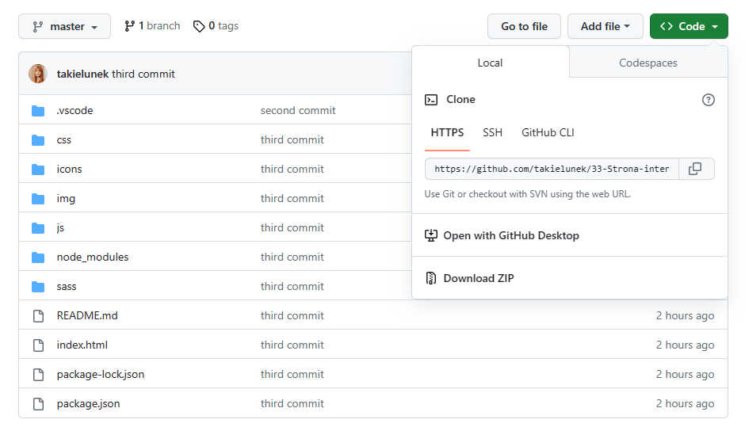
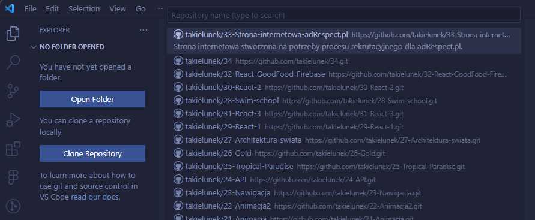

# Recruitment task

## Table of Contents
* [General Info](#general-information)
* [Technologies Used](#technologies-used)
* [Features](#features)
* [Setup](#setup)
* [Contact](#contact)
<!-- * [License](#license) -->

## General information
The website created for recruitment process for adRespect.pl., according to guidelines:

* use Bootstrap'a lub Tailwind'a (used: Bootstrap),
* auto-adjustment to website browser size (used: RWD),
* the presence of animations (used: navbar, carousel, drop down section),
* using Masonry library,
* non-using JavaScript library.

## Technologies Used
* HTML
* CSS
* SASS
* JavaScript ES6
* Bootstrap
* Masonry

## Features
* Hyperlinks

## Setup
* with the use of repository's website - "Download ZIP":

 

  

 

* with the use of Visual Studio Code explorator:

 

  

 

## Contact
Created by [Karolina Jesionek](mailto:karolina.anna.jesionek@gmail.com) 
